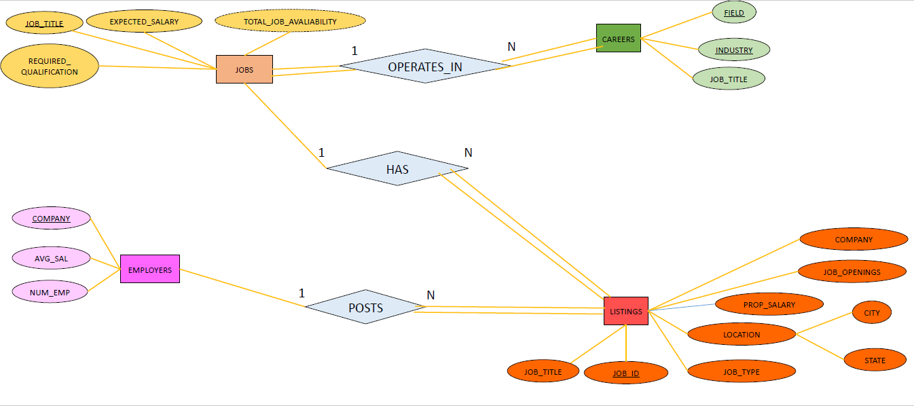
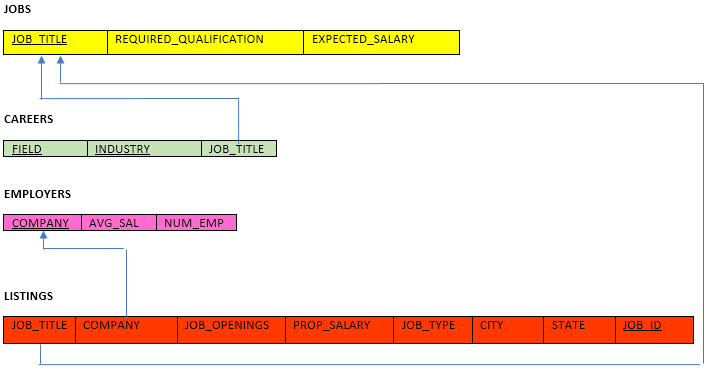

# Apply Anywhere

- A simple Node.js project which provides a job hunting platform with lightweight pages so users can easily access on the go.
- **Project demonstration video**: <https://drive.google.com/file/d/1i_41eOTiJFGCcNsoxrW3um8fMVqkIZNp/view?usp=sharing>

## Logo

## Entity Relationship Diagram

### Some attributes explanation:

1. JOBS/EXPECTED_SALARY: The expected salary of a job title. For example, as a software engineer, your salary is around $60000 per year. This value is provided by a site provider after researching a market.

2. JOBS/TOTAL_JOB_AVAILABILITY: A total openings of a job title. This is a derived attribute calculated from LISTINGS/OPENINGS.

3. EMPLOYERS/AVG_SAL: An average (or expected) salary of who works in that company.

4. LISTINGS/PROP_SALARY: A proposed salary from a job listing.

## Relational Schema

**The database is in BCNF**

## Contributors

- Hung H. Vu
- Cliff Kaldveer